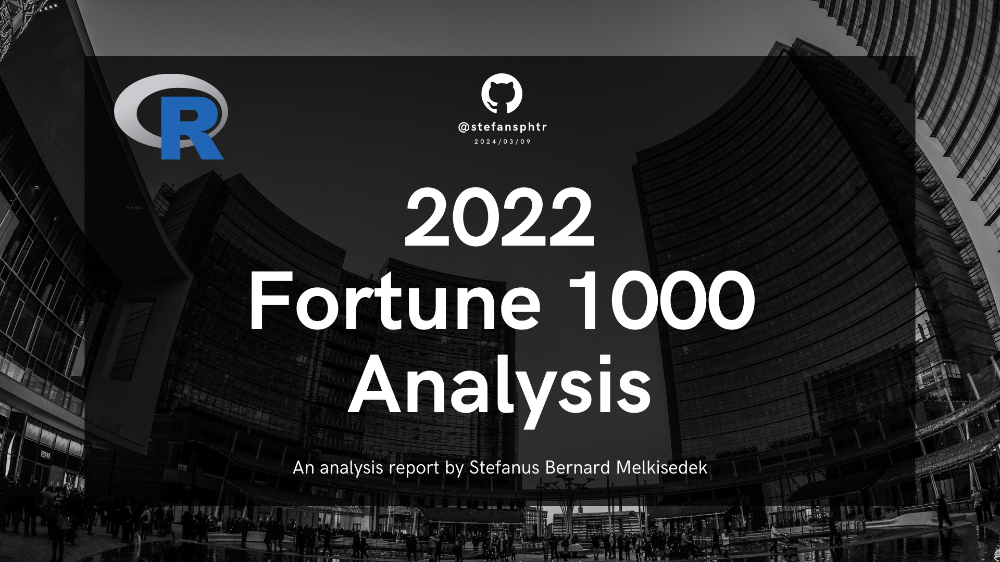

# Capstone Project Data Analytics: R Analysis of the 2022 Fortune 1000 Dataset
---

---
## Data Analysis Summary
**The objective of this capstone project is** to analyze the 2022
Fortune 1000 firms in order **to analyze and gain insight from the data**. The dataset is sourced from the Kaggle website: [2022 Fortune
1000](https://www.kaggle.com/datasets/winston56/fortune-500-data-2021/data).
The **dataset provides updated U.S. firm data for the year 2022**,
replacing the previous data from 2021.

### Table of Data Analysis Summary

| Step               | Description                                                                                                                                                                                                                                                                                                                                 |
|--------------------|---------------------------------------------------------------------------------------------------------------------------------------------------------------------------------------------------------------------------------------------------------------------------------------------------------------------------------------------|
| Data Cleaning      | The column names were cleaned for consistency and ease of use. The Market Cap column was converted to a double data type. Missing values in the profit, num_of_employees, ticker, prev_rank, and market_cap columns were handled. Invalid values in the ceo column were filled with ‘Unknown’.                                               |
| Univariate Analysis| The distribution of market_cap, revenue, profit, and num_of_employees were analyzed. It was found that these distributions are left-skewed, indicating the presence of some companies with very high values in these categories.                                                                                                                |
| Bivariate Analysis | A scatter plot was created to visualize the relationship between market_cap and revenue.                                                                                                                                                                                                                                                    |
| Handling Outliers  | Outliers in the revenue, market_cap, and profit columns were not handled as they are common in the business world.                                                                                                                                                                                                                           |
| Missing Values     | Missing values in the Ticker and Market Cap columns were identified. The missing Ticker values indicate private companies, while the missing Market Cap value needs to be handled as it’s important for the analysis. Similarly, missing values in the profit and num. of employees columns need to be handled.                               |
| Duplicate Rows     | The duplicated() function was used to check for duplicate rows in the dataset. It was found that there are no duplicate rows.                                                                                                                                                                                                               |

## Data Dictionary

**Table of Data Dictionary**

| Field           | Description |
|-----------------|-------------|
| company         | Name of the company |
| rank            | The 2021 rank established by Fortune (1-1000) |
| rank_change     | The change in the rank from 2020 to 2021. There is only a rank change listed if the company is currently in the top 500 and was previously in the top 500. |
| revenue         | Revenue of each company in millions. This is the criteria used to rank each company. |
| profit          | Profit of each company in millions. |
| num_of_employees| The number of employees each company employs. |
| sector          | The sector of the market the company operates in. |
| city            | The city where the company's headquarters is located. |
| state           | The state where the company's headquarters is located |
| newcomer        | Indicates whether or not the company is new to the top Fortune 500 ("yes" or "no"). No value will be listed for companies outside of the top 500. |
| ceo_founder     | Indicates whether the CEO of the company is also the founder ("yes" or "no"). |
| ceo_woman       | Indicates whether the CEO of the company is a woman ("yes" or "no"). |
| profitable      | Indicates whether the company is profitable or not ("yes" or "no"). |
| prev_rank       | The 2020 rank of the company, as established by Fortune. There will only be previous rank data for the top 500 companies. |
| ceo             | The name of the CEO of the company |
| website         | The url of the company website |
| ticker          | The stock ticker symbol of public companies. Some rows will have empty values because the company is a private corporation. |
| market_cap      | The market cap (or value) of the company in millions. Some rows will have empty values because the company is private. Market valuations were determined on January 20, 2021. |

## Project Link

You can access the project at the following URL:

[https://stefansphtr.github.io/R-Analysis-of-the-2022-Fortune-1000-Dataset/](https://stefansphtr.github.io/R-Analysis-of-the-2022-Fortune-1000-Dataset/)